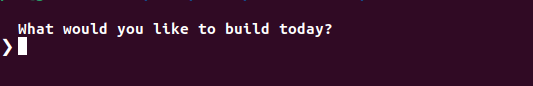
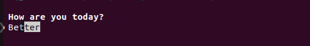
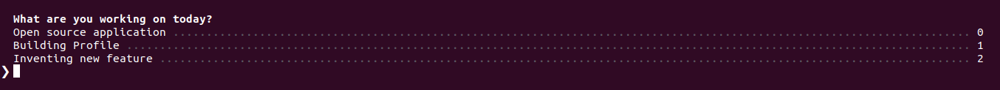
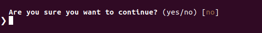
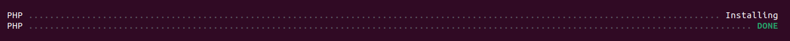
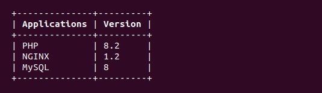

## Description

Console Components is a lightweight PHP package designed to enhance the output of your CLI applications. With Console Components, you can easily print beautiful and formatted output to the terminal using simple methods provided by the package. Say goodbye to dull and monotonous terminal output and give your applications a professional and polished look with Terminal Beautifier.

These components are extracted from Laravel's console package, that helps individual applications outside from Laravel environment.

### Installation:
You can install Console Components via Composer:
```bash
composer require uttamrabadiya/console-components
```

### Usage:

```php
use ConsoleComponents\Writer;

Writer::info('Hello World! PHP is beautiful');
```


```php
use ConsoleComponents\Writer;

Writer::warn('Please check message');
```


```php
use ConsoleComponents\Writer;

Writer::error('Something went wrong!');
```


```php
use ConsoleComponents\Writer;

Writer::alert('Hello World!');
```


```php
use ConsoleComponents\Writer;

Writer::ask('What would you like to build today?');
```



```php
use ConsoleComponents\Writer;

Writer::askWithCompletion('How are you today?', ['Good', 'Better', 'Ok Ok']);
```



```php
use ConsoleComponents\Writer;

Writer::bulletList(['Item 1', 'Item 2', 'Item 3']);
```


```php
use ConsoleComponents\Writer;

Writer::choice('What are you working on today?', ['Open source application', 'Building Profile', 'Inventing new feature']);
```



```php
use ConsoleComponents\Writer;

Writer::confirm('Are you sure you want to continue?');
```



```php
use ConsoleComponents\Writer;

Writer::twoColumnDetail('PHP', 'Installing');
Writer::task('PHP');
```



```php
use ConsoleComponents\Writer;

Writer::table(['Applications', 'Version'], [['PHP', '8.2'], ['NGINX', 1.2], ['MySQL', 8.0]]);
```



## License

Console Components is open-sourced software licensed under the [MIT license](http://opensource.org/licenses/MIT)
